# 📄 Planeación del Sistema en Jira

## Desglose de trabajo: Épicas, Historias de Usuario y Tareas

La implementación de los requerimientos identificados de Bankify se desglosa de la siguiente manera:

### 1. Épica:
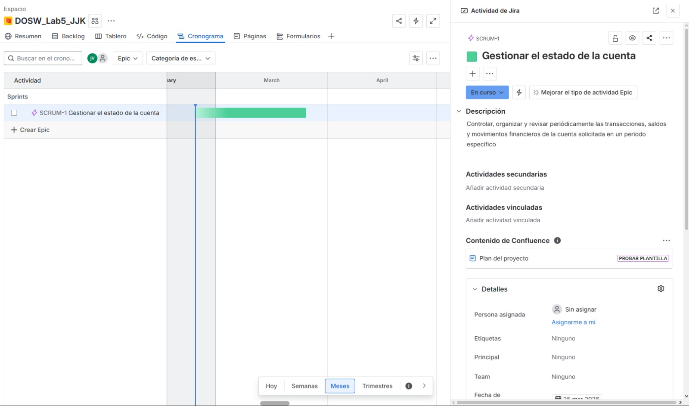

### 2. Historias de usuario:
| Historia 1 | Historia 2 | Historia 3 | Historia 4 |
| :---: | :---: | :---: | :---: |
| 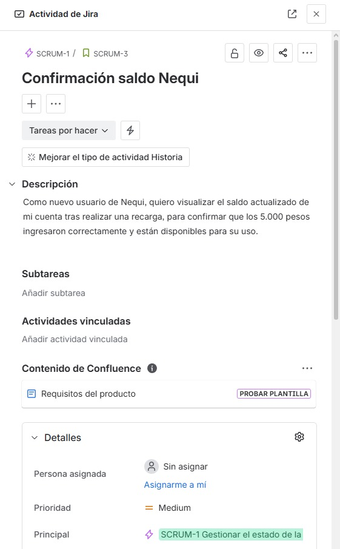 | 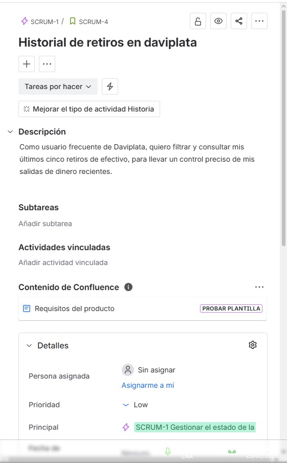 | 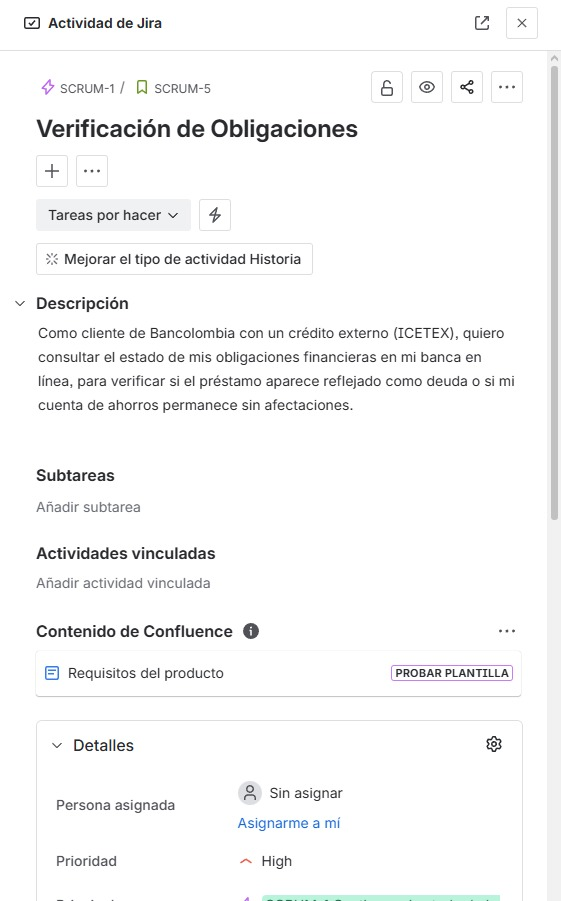 | 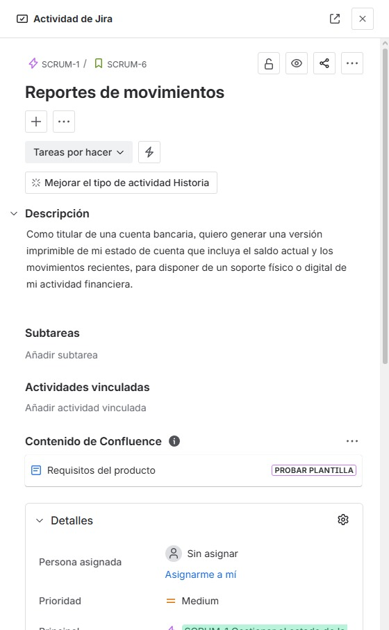 |

### 3. Tareas:

#### Sc1
| Tarea 1 | Tarea 2 | Tarea 3 |
| :---: | :---: | :---: |
| 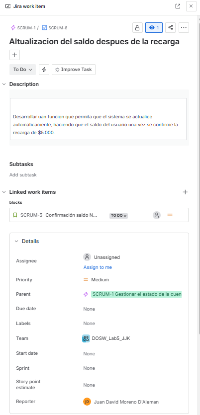 | 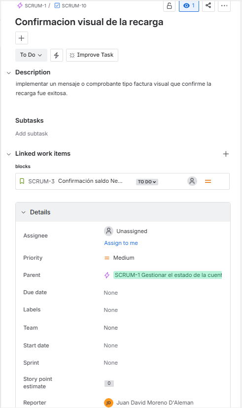 | 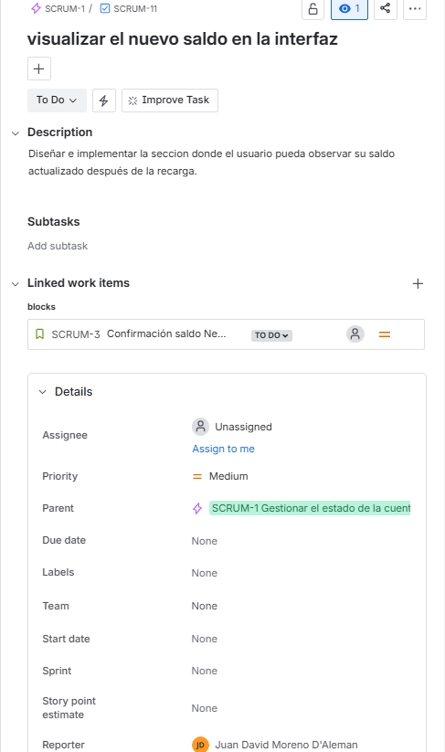 |

#### Sc2
| Tarea 4 | Tarea 5 | Tarea 6 |
| :---: | :---: | :---: |
| 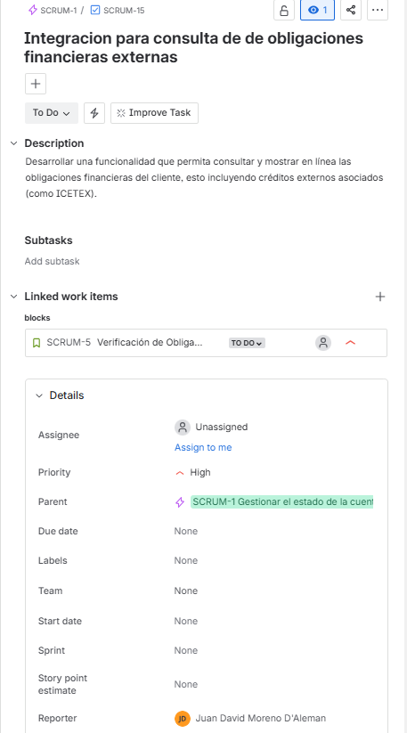 | 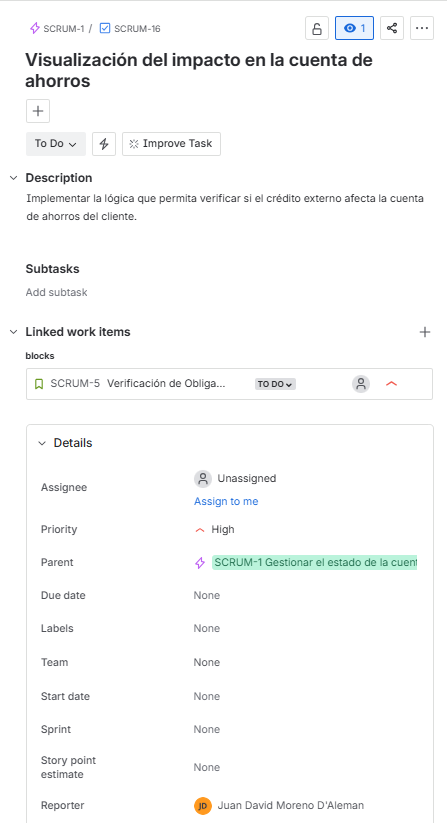 | 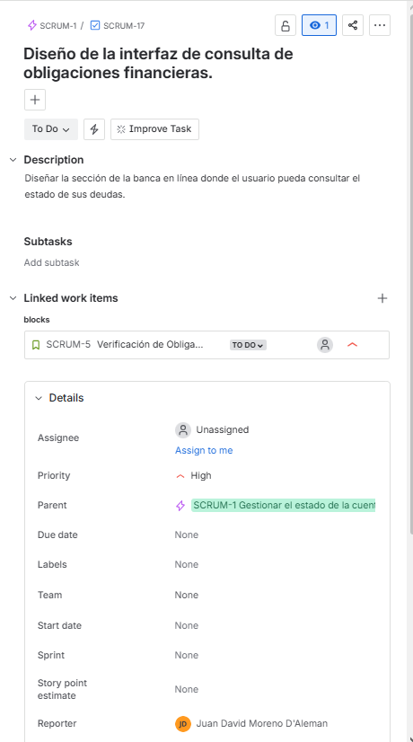 |

#### Sc3
| Tarea 7 | Tarea 8 | Tarea 9 |
| :---: | :---: | :---: |
| 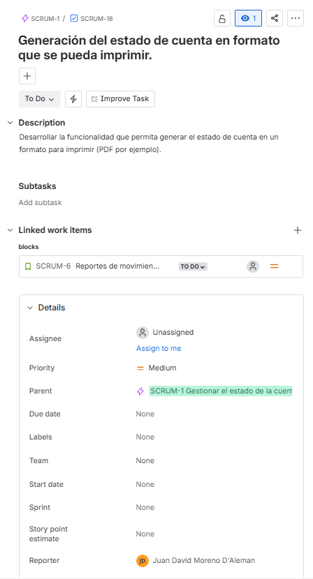 | 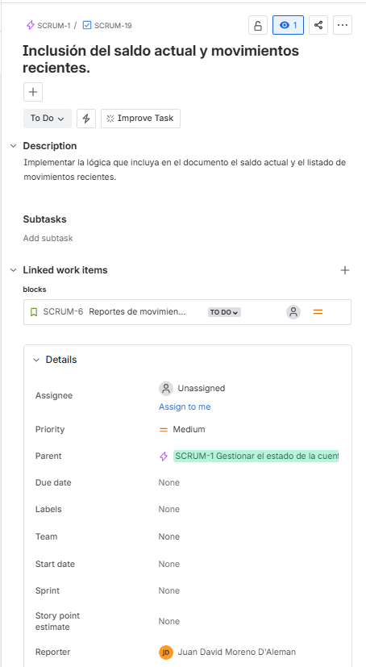 | 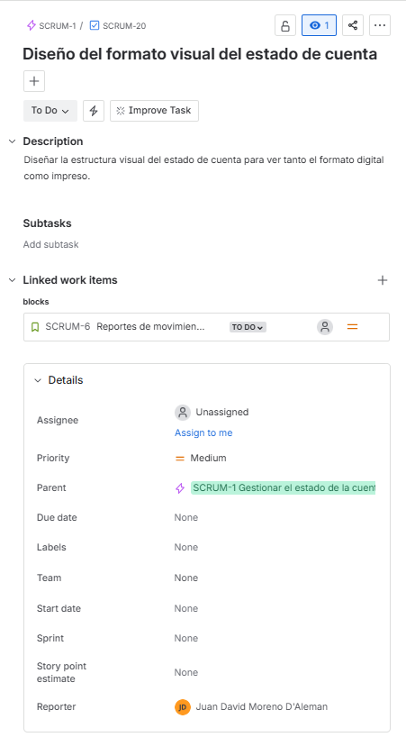 |

#### Sc4
| Tarea 10 | Tarea 11 | Tarea 12 |
| :---: | :---: | :---: |
| 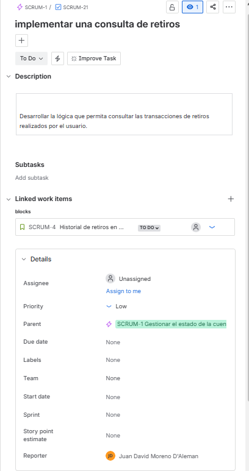 | 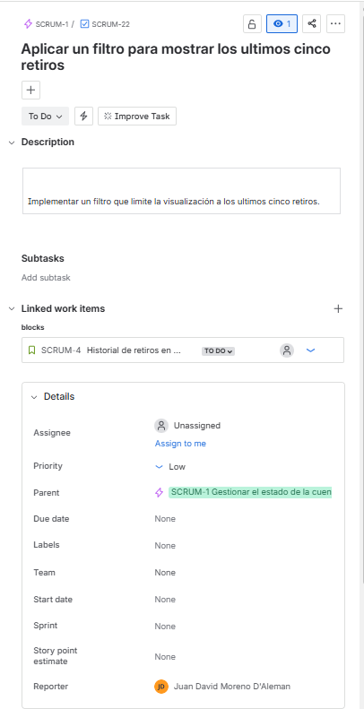 | 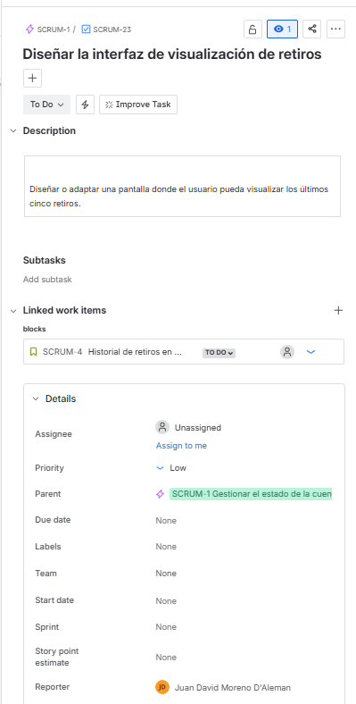 |

---

### 4. Cronograma:
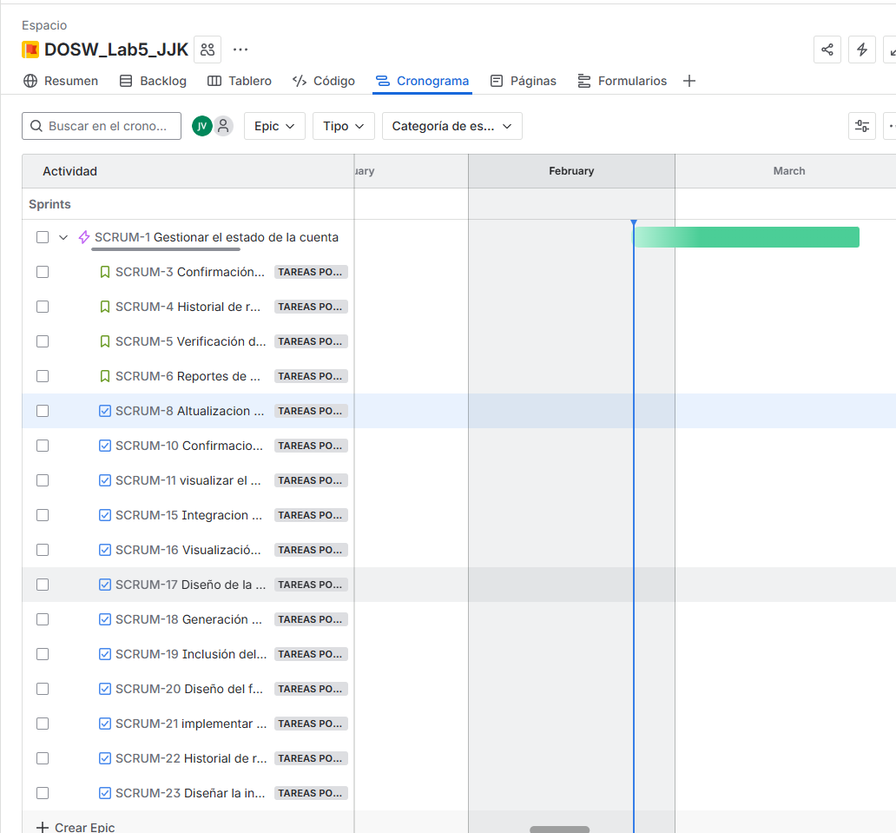

### 5. Backlog:
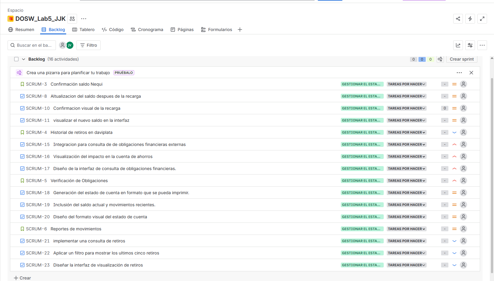

### explicacion de distribucion de tareas

la distribucion de tareas fue decidida en base a los roles pactados en el laboratorio anterior donde el integrante Juan Pablo Vega realizaria el backend, Karol Ximena Rodriguez el Frontend y Juan David Moreno lo relacionado con la base de datos. por lo que se les asigno una tarea relacionada con su rol y las fortalezas de cada uno
